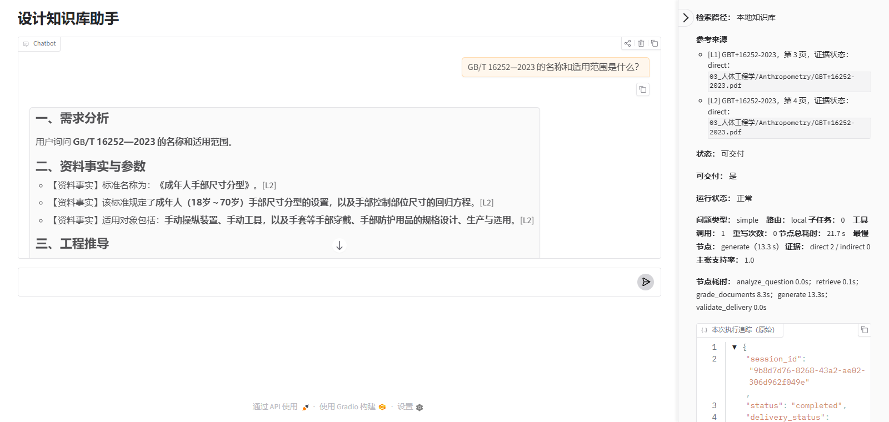
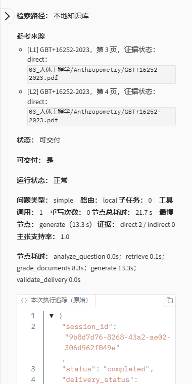
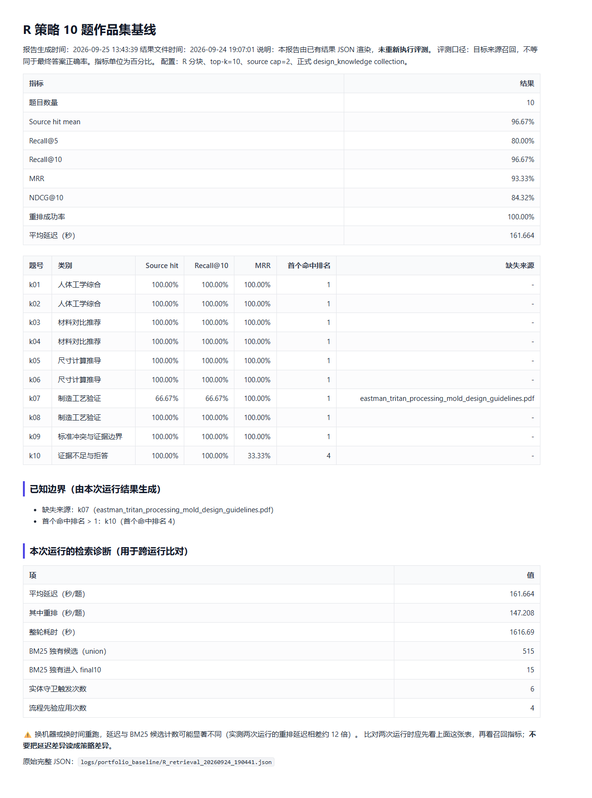
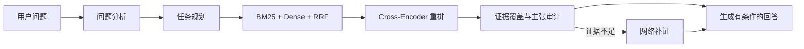

# 设计知识库助手

这是一个面向设计知识库的、可审计的 CRAG + Web Search Agent：简单问题优先检索本地知识库；复杂/对比问题会先拆解为子任务并行检索，再聚合回答；本地证据不足时，使用 DuckDuckGo 搜索摘要补充回答。

当前版本已经具备作品集级 v1.0 的主要工程能力：领域无关的问题契约（ProblemSpec）、动态任务图（TaskSpec）、BM25 + Dense + RRF 混合检索、Cross-Encoder 重排、统一工具注册、工具超时/重试、执行轨迹、证据覆盖审计、来源冲突检测、并发限制、token 预算和会话检查点。规划路径、任务结构、工具调用、证据覆盖和节点耗时会显示在界面右侧的“本次执行追踪”面板。规划器不会针对某个具体产品或材料写专用流程，问题中的领域词汇只作为动态输入参与检索。

## 作品集 v1.0

### 项目定位

项目面向设计研究和设计决策辅助，重点展示“检索结果是否真的支持回答”，而不是只展示一个聊天窗口。回答会区分资料事实、工程推导、设计假设和待验证项；网络搜索结果会标记为需要核验，不能替代正式标准、法规认证或产品测试。

### Demo

| 主界面 | 执行追踪 | 评测基线 |
|---|---|---|
|  |  |  |

演示问题：`GB/T 16252—2023 的名称和适用范围是什么？`

- 主界面：问题、最终回答（含 `[L1]`/`[L2]` 引用）、右侧参考来源清单（每条带 `direct`/`indirect` 证据状态）
- 执行追踪：问题类型 / 路由 / 子任务数 / 工具调用数 / 重写次数 / 节点总耗时 / 最慢节点 / 证据计数 / 主张支持率，下方是原始 JSON
- 评测基线：R 策略 10 题指标 + 已知边界 + 检索诊断（`logs/portfolio_baseline/`）

录屏：`docs/portfolio/demo_recording.mp4`（H.264，743 KB，真实时间**未加速未剪辑**；
`.webm` 原件同目录）。**静音**——按 `作品集Demo讲稿.md` 自己配旁白。

截图与录屏都由 `python scripts/capture_portfolio_assets.py` 驱动真实界面产生，
不是手工摆拍；`capture_summary.json` 记录了那一次的耗时与交付判定。

#### ⚠️ 这道题的耗时不可复现，而且**不是**分类造成的

2026-09-25 同一配置、同一道题连续六次运行。**六次都是** `question_type=simple`、
`sub_tasks=0`（不规划），`problem_spec` 逐字段相同
（`intent=simple`、`explicit_references=['GB/T 16252—2023']`）：

| 时间 | 检索耗时 | 结果 |
|---|---:|---|
| 14:19 | **0.1 s** | 可交付，2 条 `direct` 证据（本仓库截图与录屏即此次） |
| 14:16 | 0.1 s | 可交付，但**先被闸门拦下、严格重写一次**后才通过 |
| 14:14 | 0.1 s | 可交付，2 条 `direct` 证据 |
| 14:10 | 0.2 s | 可交付，2 条 `direct` 证据 |
| 13:47 | 0.2 s | 可交付，2 条 `direct` 证据 |
| 13:54 | **300.0 s（撞上限）** | **降级拒答**：本地检索超时 + 网络搜索超时 → **0 条来源** |

**同样的输入，检索一次 0.1 秒、一次 300 秒。** 快速那几次的
`retrieval_evidence_reason` 是「资料命中用户指定标准或参考编号」，只返回被问的那份标准本身的
2 个 chunk；撞上限那次 0 条来源，`status=web_empty`、`deliverable=false`。

**根因未定位**（已作为未决问题记录）。所以：

- 本仓库**不提供**「答案正确率」或「平均响应时间」这类单值指标
- 13:54 那次降级的原始记录保留在 `docs/portfolio/evidence_degraded_run_20260925_135405.json`
  与其追踪截图里，**不隐藏失败的那一次**
- 延迟也高度依赖机器负载：R 基线同一条配置三次运行的每题均值是 26.0 / 84.5 / 161.7 秒

### 系统链路



### R 策略 10 题基线

以下结果来自 `logs/portfolio_baseline/R_baseline_20260924_190441.md`（原始 JSON 同目录），
评测的是**目标来源召回**，不是最终答案正确率。结果是 R 分块策略与当前混合检索、
实体保护和来源权威性排序配置的组合基线。

| 指标 | 结果 |
|---|---:|
| 题目数量 | 10 |
| Source hit mean | 96.67% |
| Recall@5 | 80.00% |
| Recall@10 | 96.67% |
| MRR | 93.33% |
| NDCG@10 | 84.32% |
| 重排成功率 | 100% |

**延迟不放在这张表里。** 同一条配置在本机三次运行，每题平均延迟分别是
**26.0 s / 84.5 s / 161.7 s**（其中重排占 6.1 s / 74.9 s / 147.2 s），
而**召回指标在其中两次里逐项完全相同**。延迟取决于重排器跑在哪个设备上、
以及当时机器有多忙——**不要把它读成策略差异**。每次运行的实际延迟记在该次报告末尾的
「检索诊断」表里，那张表同时给出 BM25 候选计数，用于判断两次运行是否可比。

三次运行（都在仓库里）：

| 运行 | 原始文件 | 指标 |
|---|---|---|
| 2026-09-08 | `logs/retrieval_ablations/final_R.json` | 与 09-24 逐项相同 |
| 2026-09-13 | `logs/portfolio_baseline/R_retrieval_20260913_202524.json` | **离群**，见下 |
| 2026-09-24 | `logs/portfolio_baseline/R_retrieval_20260924_190441.json` | 与 09-08 逐项相同 |

边界结果也会保留：k07 缺少一个 Tritan 工艺指南来源
（`eastman_tritan_processing_mold_design_guidelines.pdf`）；k10 虽然命中目标来源，
但首个目标来源排名为第 4。它们是当前基线的已知限制，不会被隐藏或改写成答案准确率。

⚠️ 目录里还留着一次 2026-09-13 的运行（`R_baseline_20260913_202524.md`），
它给出 Recall@10 = 100%、且**没有任何缺失来源**。它的 BM25 候选计数（676 vs 515）
和流程先验次数（1 vs 4）都与两次可复现运行不同，因此**不作为基线**——
保留它是为了说明基线之外存在什么，而不是为了挑一个更好看的数字。

逐题结果和原始检索诊断见 `logs/portfolio_baseline/`；运行方式见 `scripts/Run-RBaseline.ps1`。

作品集 Demo 的固定问题、讲解顺序、截图清单和面试追问见 `作品集Demo讲稿.md`。交付前的环境检查报告由 `scripts/Check-PortfolioReadiness.ps1` 生成。

## 1. 进入项目环境

推荐把虚拟环境放在 ASCII 路径，避免 Windows 对中文工作区中的 `.venv` 启动失败：

```powershell
py -3.14 -m venv E:\venvs\design-kb-round2
E:\venvs\design-kb-round2\Scripts\Activate.ps1
python -m pip install -r E:\设计知识库助手\requirements.txt
```

如果当前 `.venv` 可以正常启动，也可以在 PowerShell 中使用点调用，让缓存变量和虚拟环境在当前终端生效：

```powershell
. .\scripts\Enter-Project.ps1
```

项目脚本会把 pip 缓存指向公共目录 `E:\AI-Infra\pip-cache`，共享 wheel
保存在 `E:\AI-Infra\wheels`。HuggingFace、Torch、Gradio 和临时文件仍位于
项目根目录，避免使用 C 盘默认缓存。

使用 ASCII 路径虚拟环境时，缓存环境变量可以单独设置：

```powershell
$env:AI_INFRA_DIR = 'E:\AI-Infra'
$env:PIP_CACHE_DIR = 'E:\AI-Infra\pip-cache'
$env:HF_HOME = 'E:\设计知识库助手\.cache\huggingface'
$env:TORCH_HOME = 'E:\设计知识库助手\.cache\torch'
$env:TEMP = 'E:\设计知识库助手\.tmp'
$env:TMP = $env:TEMP
$env:GRADIO_TEMP_DIR = 'E:\设计知识库助手\data\gradio_tmp'
```

## 2. 安装 CUDA Torch 和项目依赖

```powershell
.\scripts\Install-CudaTorch.ps1
python -m pip install -r requirements.txt
```

CUDA Torch wheel 约 1.9GB。安装脚本第一次运行时将 wheel 下载到
`E:\AI-Infra\wheels`，以后其他 Python 3.14 项目可以复用该文件；每个项目的
虚拟环境仍会保留自己的已安装副本。

验证 GPU：

```powershell
python -c "import torch; print(torch.__version__); print(torch.cuda.is_available()); print(torch.cuda.get_device_name(0))"
```

## 3. 配置 LLM（OpenAI 或兼容接口）

在项目根目录创建 `.env`，参考 `.env.example` 填写：

```dotenv
LLM_API_KEY=你的密钥
LLM_BASE_URL=https://api.openai.com/v1
LLM_MODEL=gpt-4o-mini
EMBEDDING_MODEL_PATH=E:\AI-Infra\models\embeddings\bge-m3
EMBEDDING_DEVICE=cuda
RETRIEVAL_DEVICE=cpu
EMBEDDING_BATCH_SIZE=32
```

BGE-M3 的 PyTorch 权重约 2.3GB，推理时还会产生中间张量。本项目的设备策略是：
入库批量嵌入用 GPU（`EMBEDDING_DEVICE=cuda`），检索时的查询编码用 CPU
（`RETRIEVAL_DEVICE=cpu`），Chroma 检索本身只跑 CPU；这样检索服务不占用显存，
GPU 只服务于入库批量编码。如果显卡没有可用 CUDA，把 `EMBEDDING_DEVICE` 改为
`cpu` 即可。项目会按设备分别共享一个 embedding 模型实例，并将检索调用串行化，
避免并发请求重复制造显存峰值。

`EMBEDDING_BATCH_SIZE` 对入库速度影响很大：RTX 3060 6GB 上 batch=1 约 39
chunks/s，batch=32 约 280 chunks/s（快约 7 倍），峰值显存约 2.3GB；6GB 卡用 32
安全，显存紧张时可降到 8。注意：入库耗时的大头通常是 PDF 解析和 OCR（纯 CPU），
嵌入本身在 GPU 上很快。

显式环境变量的优先级高于 `.env`：实验脚本可以在子进程中临时设置
`CHUNKING_STRATEGY`、`CHROMA_DIR` 和 `COLLECTION_NAME`，而不会修改正式配置。
若终端里残留了旧变量，可先使用 `Remove-Item Env:变量名` 清理。

`.env` 已加入 `.gitignore`，不要把真实密钥写入 `.env.example`。

## 4. 导入知识库

### 分块策略

通过 `.env` 中的 `CHUNKING_STRATEGY` 选择入库分块方式：`F` 为固定长度、`R` 为当前递归字符分块、`P` 为段落/章节语义分块，`V` 预留给后续向量语义边界算法。切换策略后必须使用 `--full` 重建索引。

可以在不覆盖正式知识库的情况下创建独立实验索引：

```powershell
.\scripts\Prepare-ChunkingExperiment.ps1 -Strategy R
.\scripts\Prepare-ChunkingExperiment.ps1 -Strategy P
.\scripts\Prepare-ChunkingExperiment.ps1 -Strategy F
```

实验索引分别保存在 `data\chunking_experiments\R`、`P` 和 `F`。脚本会记录策略、参数、collection、模型路径、模型文件指纹、chunk 统计和创建时间。

使用实验索引进行同一组约 10 题的纯检索对照（不会调用生成模型，也不会改动正式 `data\chroma_db`）：

```powershell
.\scripts\Run-ChunkingEvaluation.ps1 -Strategies R,P,F -QuestionCount 10
```

可用 `-SourceCap 2`、`-SourceCap 3` 或 `-SourceCap 0` 对照来源上限；`0` 表示不限来源 chunk 数。
每题结果还包含候选原始排名、阈值过滤和 source cap 过滤原因，用于定位漏召回来源。

可一次性运行来源上限对照（`cap=2`、`cap=3`、不限 cap）：

```powershell
.\scripts\Run-ChunkingCapExperiments.ps1 -Strategies F,R,P -QuestionCount 10
```

结果分别写入 `logs\chunking_cap_experiments\cap_2`、`cap_3` 和 `no_cap`。

LangSmith 对照也支持相同参数，例如：

```powershell
.\scripts\Run-ChunkingLangSmith.ps1 -Strategies F,R,P -SourceCap 3 -ExperimentPrefix design-kb-cap3
```

该脚本会临时设置 `CHROMA_DIR`、`COLLECTION_NAME` 和 `CHUNKING_STRATEGY`，分别读取三个独立 collection，
对完全相同的 10 题输出三份独立 JSON，并额外输出一份 `summary_*.json` 到 `logs\chunking_experiments`，包含 source_hit、Recall、MRR、NDCG 和延迟。

如果希望在 LangSmith 的 **Datasets & Experiments** 页面查看结果，使用专用的 10 题数据集和上传脚本：

```powershell
.\scripts\Run-ChunkingLangSmith.ps1 -Strategies R,P,F
```

该命令会创建或同步独立数据集 `design-knowledge-chunking-10`，并上传三个独立实验：
`design-kb-chunking-R`、`design-kb-chunking-P`、`design-kb-chunking-F`。原有的 20 题和 35 题数据集不会被修改。
每个实验只运行本地检索，上传 `source_hit`、`recall_at_5`、`recall_at_10`、`mrr`、`ndcg_at_10`，
以及每题的缺失来源、去重前后来源数和完整候选排序信息。

检索顺序固定为：规则词典扩展 -> BM25/Dense 初召回 -> RRF/可选重排 -> 动态阈值过滤 -> 来源上限压制。
评测 JSON/LangSmith 输出还会保存扩展查询、阈值是否通过、压制前排名、最终排名和 source 去重后的首次命中排名。

本轮统一检索优化只修改 Dense/BM25/RRF/来源多样性排序，不改变文档内容和分块结果；
已有 `data\chunking_experiments\F|R|P` 索引无需重新入库，直接重新运行评测即可。

手动指定某个实验库时，必须在启动 Python 前设置变量；已经运行的 `app.py` 需要重启：

```powershell
$env:CHUNKING_STRATEGY = 'P'
$env:CHROMA_DIR = (Resolve-Path '.\data\chunking_experiments\P').Path
$env:COLLECTION_NAME = 'design_knowledge_p'
python app.py
```

把真实 PDF、TXT 或 Markdown 文档放入 `data\documents\设计知识库` 下对应的分类目录，然后执行：

```powershell
python ingest.py
```

该命令从源文档完整重建 Chroma collection。重复运行不会积累重复 chunk；资料目录为空时不会清除旧数据库。
重建会先写入临时目录，并在重新打开和查询验证通过后替换正式数据库；若嵌入或索引构建中断，原数据库不会被改动。
入库过程会显示文件加载、chunk 准备和批量编码进度。入库默认用 GPU 批量编码；如果显卡没有可用 CUDA，
需把 `EMBEDDING_DEVICE` 改为 `cpu`。仍建议从 `EMBEDDING_BATCH_SIZE=1` 开始。

如果界面报告 `HNSW 索引无法加载`，请先停止正在运行的 `app.py`，再执行：

```powershell
Remove-Item -LiteralPath .\data\chroma_db -Recurse -Force
New-Item -ItemType Directory -Path .\data\chroma_db | Out-Null
python ingest.py              # 之后每次加/改/删文档，只处理有变化的文件
python ingest.py --full       # 想彻底重建时才用（比如改了分块参数）
```

旧集合的 HNSW 配置不能原地修改，所以从旧数据库迁移时需要清空一次
`data\chroma_db`。源文档 `data\documents\设计知识库` 不会被删除。新集合针对当前几千个
chunk 使用 Chroma 的 brute-force buffer，避免 Windows 原生 HNSW 索引持久化故障。
这一选择在当前数据规模下**不是延迟的主要来源**——延迟的大头是 Cross-Encoder 重排，
具体数字见每次基线报告末尾的「检索诊断」表。

测试检索链路时，可以使用隔离的测试语料：

```powershell
python ingest.py --source-dir tests\fixtures\documents --persist-dir data\test_chroma_db --collection-name test_design_knowledge
```

测试文档是虚构内容，不应作为真实设计依据。

## 5. 测试与运行

```powershell
python -m pytest
python app.py
```

浏览器访问 `http://127.0.0.1:7860`。如果该端口已被占用，可先设置
`$env:GRADIO_SERVER_PORT=7861` 再启动。界面按单次问题展示完整执行追踪；历史消息不会作为下一次检索上下文。

作品集交付前建议先运行可复现性检查和固定 R 策略基线：

```powershell
.\scripts\Check-PortfolioReadiness.ps1
.\scripts\Run-RBaseline.ps1 -NoLangSmithUpload
```

如果项目目录包含中文字符导致现有 `.venv` 启动失败，请按
`作品集第一优先级交付计划.md` 在 ASCII 路径重新创建虚拟环境，再运行上述命令。

PowerShell 一键运行回归与评测：

```powershell
.\scripts\Run-Evaluation.ps1 -CheckOnly
# 通用设计决策质量评测
.\scripts\Run-Evaluation.ps1 -DecisionQuality
# 复杂问题 35 题评测：创建/同步 Dataset，并生成 Experiment
.\scripts\Run-Evaluation.ps1 -ComplexQuality
# 先跑 3 题冒烟（仍会上传到 LangSmith Experiment）
.\scripts\Run-Evaluation.ps1 -ComplexQuality -Limit 3
# 从第 11 题开始跑 10 题
.\scripts\Run-Evaluation.ps1 -ComplexQuality -Start 11 -Limit 10
# 只跑确定性的来源命中评测，不调用评测模型
.\scripts\Run-Evaluation.ps1 -ComplexQuality -Limit 3 -NoJudge
# 下载最新复杂题 Experiment 到本地 logs
.\scripts\Run-Evaluation.ps1 -DownloadComplex
# 下载指定 Experiment
.\scripts\Run-Evaluation.ps1 -DownloadComplex -Experiment design-kb-complex-xxxxxxxx
```

复杂问题评测集在 `data/test_qa_35_complex.json`，脚本是 `eval_complex_qa.py`。它会复用当前知识库 Agent，默认不启用网络搜索，串行执行，并通过 LangSmith SDK 创建或同步 Dataset `design-knowledge-qa-complex-35`，再生成 Experiment。结果请在 LangSmith 的 **Datasets & Experiments** 页面查看，不依赖 tracing 项目。

建议先冒烟再全量：

```powershell
.\scripts\Run-Evaluation.ps1 -ComplexQuality -Limit 3
.\scripts\Run-Evaluation.ps1 -ComplexQuality
```

## 生成链路评测

检索侧已冻结，另有独立的一条**生成评测**链路：读冻结快照、不重新检索
（`retrieval_calls = 0`），只评判断生成答案。

```powershell
# 跑多轮独立回放（重复序号自动递增）
.\scripts\Run-P0GenerationMatrix.ps1 -Repetitions 3

# 聚合 + 出 Markdown 报告（零第三方依赖，任意 Python 均可）
python aggregate_generation_replays.py `
    data\runs\run_r1.json data\runs\run_r2.json data\runs\run_r3.json `
    --output .tmp\agg.json --report reports\report.md
```

报告分五个板块，**按依赖顺序读，不能跳**：实验可信度 → 系统可用性 →
回答质量 → 安全行为 → 引用质量。前一节不成立时，后一节的数字只描述幸存样本。

值得单独说明的三点：

**行为指标用组合判据，不用关键词词表。** 早期版本靠词表判「是否拒绝直接套用」，
同一语义行为换个措辞就在 0/1 之间翻转——「不能**无条件**作为…」判失败、
「不能**直接**作为…」判通过。现在要求否定词族（不能/不应/不宜/不得/无法）
与对象词族（直接/简单/无条件/套用/照搬/等同/当成）同时命中。修复后该题
在 7 次历史运行中的一致性从 3/7 升到 7/7。

**分组闸门。** 改动必须声明它意图影响哪些指标组；未声明的组一步都不许动
（改进也不行——那说明改动没被限定范围）。容差是双向的，不是只限涨幅。

**同配置多轮之间差异超过 10pp 时拒绝出趋势结论。** 那是测量噪声，
不是结果。

完整说明见 `docs/`：

| 文档 | 内容 |
|---|---|
| `docs/evaluation-contract.md` | 判据：组合判据、分母含义、分组闸门、flaky、小样本检验 |
| `docs/experiment-protocol.md` | 流程：怎么跑、怎么读、可得出与不可得出的结论 |
| `docs/architecture.md` | 模块职责与分层理由 |

已生成的报告见 `reports/`。

离线分析链路（聚合 / 切片 / 闸门 / 报告）**零第三方依赖**，
可在裸 Python 环境运行；CI 只跑这部分测试（`.github/workflows/offline-evaluation-tests.yml`）。

如果要允许网络搜索补证据，可以加 `-WithWeb`，但那样结果就不再只代表本地知识库能力。

### 第二轮真实问题评测（固定8题，自动上传 LangSmith）

第二轮不提供本地-only模式。每次运行都会同步 Dataset `design-knowledge-qa-round2-8`，执行全部8题，并在 LangSmith **Datasets & Experiments** 中创建新的 Experiment：

```powershell
.\scripts\Run-Round2Questions.ps1 -PythonPath 'E:\venvs\design-kb-round2\Scripts\python.exe'
```

如需额外上传 LLM 答案质量评测：

```powershell
.\scripts\Run-Round2Questions.ps1 -PythonPath 'E:\venvs\design-kb-round2\Scripts\python.exe' -WithJudge
```

如需测试网络补证路径，可增加 `-WithWeb`。运行前必须在 `.env` 中配置 `LANGCHAIN_API_KEY`；本地日志只保存上传清单，不代替 LangSmith Experiment。

运行前确认 `.env` 中至少有：

```dotenv
LANGCHAIN_API_KEY=lsv2_...
LLM_API_KEY=你的模型密钥
```

`LANGCHAIN_TRACING_V2` 会被复杂评测脚本临时设为 `false`，避免把本次评测误当作普通 tracing；但评测结果仍会以 Dataset/Experiment 形式上传。可用 `-DatasetName` 和 `-ExperimentPrefix` 指定自定义名称。

下载结果也可以直接运行：

```powershell
.\.venv\Scripts\python.exe download_langsmith_experiment.py
```

The command downloads the latest LangSmith Dataset/Experiment result to local
`logs/langsmith_experiment_*.json` and `.md` files. To download a specific
experiment, use `--experiment NAME` or the PowerShell wrapper:

```powershell
.\scripts\Run-Evaluation.ps1 -DownloadComplex -Experiment design-kb-complex-xxxxxxxx
```

脚本默认选择最新的 `design-kb-complex-*` Experiment，将结果保存为 `logs/langsmith_experiment_*.json` 和 `logs/langsmith_experiment_*.md`。

复杂问题示例：

```text
对比 ABS、PC、PP 三种材料，哪种更适合户外椅？请说明理由。
```

运行结果会生成 session checkpoint 到 `.tmp\checkpoints`，用于本地调试和后续恢复能力扩展。

LANGCHAIN_API_KEY=lsv2_你的key        # smith.langchain.com 获取
LANGCHAIN_TRACING_V2=true
LANGCHAIN_PROJECT=design-knowledge-qa

python eval_langsmith.py              # 全量评测（约 20题×3次LLM调用）
python eval_langsmith.py --check      # 本地预检，不花钱不联网（我刚跑过）
