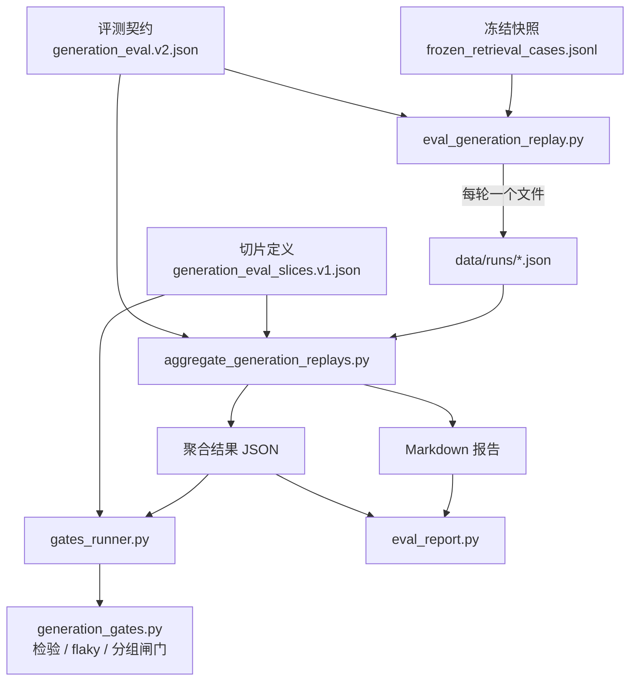

# 评测链路结构

本文件说明生成评测这条链路由哪些模块组成、数据如何流动，以及每个模块为什么被单独拆出来。

## 全景

## 模块职责

| 模块 | 职责 | 为什么独立 |
|---|---|---|
| `src/frozen_evidence.py` | 判定：把契约期望与答案比对出分数或 0/1 | 判定口径必须能单独升版，否则改一个词就要重跑全部 |
| `src/generation_slices.py` | 切片加载与校验 | 题型标签的变更节奏与答案期望不同，耦合会逼着契约升版 |
| `src/generation_gates.py` | 统计检验、flaky 检测、可比性、分组闸门 | 纯函数，无 I/O，可离线测试 |
| `src/gates_runner.py` | 桥接聚合结果与切片 / 闸门 | 聚合器保持为输入的纯函数：算数；这里做解释 |
| `src/eval_report.py` | 渲染 Markdown | 报告是给人读的产物，排版与判定分开 |
| `aggregate_generation_replays.py` | 聚合多次运行 | 只做算数与不变量校验 |
| `eval_generation_replay.py` | 单轮真实回放 | 唯一会调用模型的入口 |

分层的主线是：**算数与解释分离，判定与渲染分离**。这样判定逻辑可以脱离模型、脱离文件系统被测试，而报告排版的变化不会碰到任何指标计算。

## 判定层：三态引用审计

`soft_audit()` 输出每题的审计记录。引用不是简单的「合法/非法」二值：

- `citation_validity`——答案中出现的编号是否都在允许集合内
- `citation_metric_applicable`——本题是否**适用**引用类指标（拒答题、歧义题的正确行为可能不引用任何来源）
- `citation_id_usage_ratio`——用到的编号 / 允许的编号

`citation_metric_applicable` 这个显式标志是必要的：拒答题的 `citation_validity` 在构造上是 `True`，把它计入引用分母会稀释均值。适用性用标志声明，而不是靠推断。

同理，行为类指标在非对应题型上取 `None`，含义是**不适用**，不是失败。

## 聚合层的不变量

聚合不是简单求平均，它先校验一组前置条件，任一不满足即报错：

| 不变量 | 违反后的后果 |
|---|---|
| 五项实验身份一致 | 不同口径 / 不同提示词的运行被平均，得到无意义的数 |
| `generation_max_retries` 一致 | 不同重试策略的成功率分布不可比 |
| `retrieval_calls == 0` 且非 dry-run | 检索未被冻结，混入重新检索的结果 |
| `repetition_index` 唯一 | 两轮同号不是两次独立观测 |

这些校验放在聚合入口而不是报告里：**让错误的输入产出不了结果**，比产出一个带警告的结果可靠。

## 报告层：为什么分段而不分表

各指标不可互换，一张平表会诱导读者跨类平均。它们有两处不同，决定了可以得出什么结论：

- **关于什么**——超时率是关于服务的陈述，span 召回是关于答案文本的陈述
- **可以用来做什么**——有的是冻结组（检索一步都不许动），有的是诊断（延迟余量、重试依赖），有的是闸门

所以板块按**依赖顺序**排列：可信度 → 可用性 → 质量 → 安全 → 引用。前一块不成立时后一块只能描述幸存样本，报告把这件事写在版面里，不依赖读者记得。

每个指标都带分母。两个分母概念必须区分：

| 概念 | 含义 |
|---|---|
| `sample_size` | 被计分的观测数（多轮累加） |
| `question_count` | 涉及的题目数（去重） |

## 测试策略

`tests/` 分为两类，这条分界决定 CI 能跑什么：

**不依赖模型或 Chroma**（可在 CI 运行）：
`test_frozen_generation` / `test_generation_slices_and_gates` / `test_aggregate_slice_report` / `test_eval_report` / `test_replay_fixtures` / `test_generation_replay_aggregate` / `test_config_timeouts`

**依赖 Chroma / 模型**（需完整环境）：
`test_retriever` / `test_ingest` / `test_embeddings` / `test_graph` / `test_chunking` / `test_delivery_contract`

`test_replay_fixtures` 的价值在于：它用真实运行的录制结果离线验证判定逻辑，不需要调用模型。fixture 带 `audit_version` 校验——口径变了的旧 fixture 会被拒绝，而不是被当作当前结果，否则会制造假的指标漂移。

## 相关文件

- `docs/evaluation-contract.md`——判据本身
- `docs/experiment-protocol.md`——怎么跑、怎么读
- `reports/`——已生成的报告
